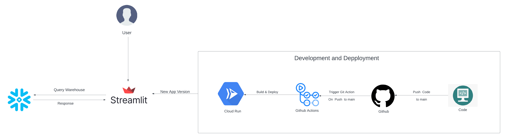

## Assignment 04: Live application Links :octopus:

- Please use this application responsibly, as we have limited free credits remaining.

[](https://assignment04-64byggjesa-pd.a.run.app/)

[](https://codelabs-preview.appspot.com/?file_id=1n75MAmBIV-t9-6I4U4SAKOnjA9vzeoFxn-50t2yD8jM)

## Problem Statement :memo:
Leverage Streamlit for data insights drawn from computing queries on snowflake warehouse that models the decision support 
functions of a retail product supplier. The supporting schema contains vital business information, such as customer, order, and product data

Understand the generalized query model utilized by TPC-DS that allows the benchmark to capture important aspects of the 
interactive, iterative nature of on-line analytical processing (OLAP) queries, the longer-running complex queries of 
data mining and knowledge discovery, and the more planned behavior of well known report queries.

## Project Goals :dart:
Task -1:
1. Design streamlit screens for different bussiness use cases.
2. Screen to authenticate snowflake credentials to compute queries.
3. Input validation on metadata that need to be chosen by user as qualification substitutions that are passed to queries.


Task -2:
1. Dockerize the streamlit application.
2. Write github actions that continuously integrate and continuously Deploy to GCP Cloud Run.
3. Deploy the streamlit application on GCP cloud run.

## Technologies Used :computer:
[](https://streamlit.io/)
[](https://github.com/)
[](https://www.python.org/)
[](https://github.com/features/actions)

## Data Source :flashlight:
1. https://docs.snowflake.com/en/user-guide/sample-data-tpcds


## Architecture Diagram


## Requirements
```
streamlit==1.23.1
pyarrow==10.0.1
snowflake-sqlalchemy
```

## Project Structure
```
📦 Assignment_04
├─ .github
│  └─ workflows
│     └─ deploy.yml
├─ .gitignore
├─ Makefile
├─ README.md
├─ docker-compose-local.yml
└─ frontend
   ├─ .gitignore
   ├─ Dockerfile
   ├─ Images
   │  ├─ Catalog_Returns.png
   │  ├─ Catalog_Sales.png
   │  ├─ Inventory.png
   │  ├─ Store_Sales.png
   │  ├─ Store_returns.png
   │  ├─ Web_Returns.png
   │  └─ Web_Sales.png
   ├─ main.py
   ├─ pages
   │  ├─ 0_Authentication.py
   │  ├─ 1_Query_1.py
   │  ├─ 2_Query_2.py
   │  ├─ 3_Query_3.py
   │  ├─ 4_Query_4.py
   │  ├─ 5_Query_5.py
   │  └─ 6_Query_6.py
   └─ requirements.txt
```
©generated by [Project Tree Generator](https://woochanleee.github.io/project-tree-generator)

## How to run Application locally
To run the application locally, follow these steps:
1. Clone the repository to get all the source code on your machine.

2. Install docker desktop on your system

3. Create a .env file in the root directory with the following variables:
    ``` 
      # Snowflake Variables
    ```

4. Once you have set up your environment variables, Start the application by executing
  ``` 
    Make build-up
  ```

5. Once the docker containers spin up, Access the application at following links
    ``` 
     1. Stremlit UI: http://localhost:30006/
    ```

6. To delete all active docker containers execute
     ``` 
     Make down
     ``` 

## References
1. Snowflake Sample Data: https://docs.snowflake.com/en/user-guide/sample-data-tpcds
2. Snowflake SQLAlchemy Connector: https://docs.snowflake.com/developer-guide/python-connector/sqlalchemy
3. TPC-DS Schemas: https://www.tpc.org/tpc_documents_current_versions/pdf/tpc-ds_v2.5.0.pdf
4. Queries: https://github.com/gregrahn/tpcds-kit
5. Streamlit: https://docs.streamlit.io/
6. Github Actions: https://docs.github.com/en/actions
7. Google Cloud Run: https://cloud.google.com/run#section-4
8. Github Action for GCloud Authentication: https://github.com/marketplace/actions/authenticate-to-google-cloud

## Learning Outcomes
1. To leverage streamlit for visualization/data insights drawn from snowflake computations.
2. Demoralising tables and querying according to the case.
3. Leverage github actions to continuously integrate and deploy on google cloud run.


## Team Information and Contribution

Name | Contributions 
--- | --- |
Sanjana Karra | Designed Streamlit screen for Query1, Query 2, Main Screen
Nikhil Reddy Polepally | Designed Streamlit screen for Query 5, Query 6, Documentation
Shiva Sai Charan Ruthala | Designed Streamlit screen for Query 3, Query 4, Deployment
